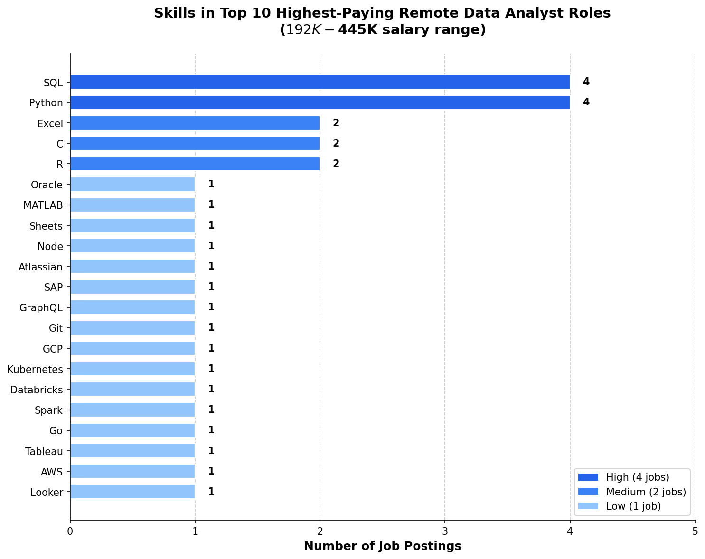

# Data Analyst Job Market Analysis (2024) 📊

Analysis of the 2024 data analyst job market, focusing on top-paying roles, in-demand skills, and the most optimal skills to learn — using SQL.

## Background

As someone actively job searching in the data analytics space, I wanted to go beyond generic career advice and let the **data** tell me what skills actually matter. Using Luke Barousse's [2024 job postings dataset](https://lukebarousse.com/sql), I explored what employers are paying for, what they're asking for, and where demand meets salary.

### Questions I Set Out to Answer

1. What are the top-paying remote Data Analyst jobs?
2. What skills do those top-paying roles require?
3. What are the most in-demand skills for Data Analysts?
4. What are the top skills based on salary?
5. What are the most optimal skills to learn (high demand + high salary)?

## Tools I Used

- **SQL** (PostgreSQL) — The backbone of the entire analysis. Every insight came from writing queries against a relational database.
- **PostgreSQL** — Database management system used to store, query, and analyze the job postings data.
- **Visual Studio Code** — SQL query writing and execution via the SQLTools extension.
- **Git & GitHub** — Version control and project sharing.

## Database Setup

The database consists of four tables:

| Table | Description |
|-------|-------------|
| `job_postings_fact` | Job postings with titles, salaries, locations (PK: `job_id`) |
| `company_dim` | Company names and links (PK: `company_id`) |
| `skills_dim` | Skill names and categories (PK: `skill_id`) |
| `skills_job_dim` | Bridge table linking jobs to skills (FK: `job_id`, `skill_id`) |

**Relationships:** `job_postings_fact` connects to `company_dim` via `company_id`, and to `skills_dim` through the `skills_job_dim` bridge table using `job_id` and `skill_id`.

Setup scripts are in the [`sql_load/`](sql_load/) folder:
1. `1_create_database.sql` — Creates the `sql_course` database
2. `2_create_tables.sql` — Creates table schemas with keys and indexes
3. `3_modify_tables.sql` — Loads CSV data into tables

## The Analysis

### 1. Top-Paying Remote Data Analyst Jobs

**Question:** What are the highest-paying Data Analyst roles available remotely?

```sql
SELECT
    job_id,
    job_title,
    job_location,
    job_schedule_type,
    salary_year_avg,
    job_posted_date,
    name AS company_name
FROM
    job_postings_fact
LEFT JOIN company_dim
    ON job_postings_fact.company_id = company_dim.company_id
WHERE
    job_location = 'Anywhere' AND
    job_title_short = 'Data Analyst' AND
    salary_year_avg IS NOT NULL
ORDER BY
    salary_year_avg DESC
LIMIT 10;
```

**Results:**

| Company | Role | Salary |
|---------|------|--------|
| Netflix | Analytics Engineer (L5) | $445,000 |
| Siemens | Financial & Data Analyst - Pricing | $385,000 |
| Confluent | Director of Engineering - Analytics | $296,910 |
| Edge & Node | Data Analyst | $264,000 |
| Nurp | AI Deep Learning Quantitative Analyst | $230,000 |
| Get It Recruit | Product Data Analyst | $226,500 |
| Atlassian | Head of FP&A, Data & Analytics | $224,000 |
| Mayo Clinic | Principal Data Science Analyst | $205,421 |
| Pfizer | Medical Analytics | $198,500 |
| Smartcat | Data Analyst (HR & Finance) | $192,000 |

**Insight:** The salary range is massive — $192K to $445K. Even the "lowest" in the top 10 pays nearly $200K. These roles span industries from tech (Netflix, Confluent) to healthcare (Mayo Clinic, Pfizer) to finance (Siemens, Atlassian).

---

### 2. Skills Required for Top-Paying Roles

**Question:** What skills do those top 10 highest-paying roles actually require?

```sql
WITH top_paying_jobs AS (
    SELECT
        job_postings_fact.job_id,
        job_title,
        salary_year_avg,
        name AS company_name
    FROM
        job_postings_fact
    LEFT JOIN company_dim
        ON job_postings_fact.company_id = company_dim.company_id
    WHERE
        job_location = 'Anywhere' AND
        job_title_short = 'Data Analyst' AND
        salary_year_avg IS NOT NULL
    ORDER BY
        salary_year_avg DESC
    LIMIT 10
)

SELECT
    top_paying_jobs.*,
    skills
FROM
    top_paying_jobs
INNER JOIN skills_job_dim ON top_paying_jobs.job_id = skills_job_dim.job_id
INNER JOIN skills_dim ON skills_job_dim.skill_id = skills_dim.skill_id
```


*Bar chart showing skill frequency across the top 10 highest-paying remote Data Analyst roles*

**Key Insights:**

1. **SQL + Python dominate** — Both appear in 44% of top-paying roles ($192K–$445K). At this salary level, they're foundational.
2. **Excel persists at high salaries** — Siemens ($385K) and Smartcat ($192K) both require Excel. It's not just for entry-level.
3. **Cloud/infrastructure skills unlock $300K+** — Netflix ($445K) needs SQL + Python. Confluent ($297K) needs Kubernetes. Engineering-adjacent skills push salaries higher.
4. **BI tools (Tableau, Looker) are rare** — Only Edge & Node lists them. At these levels, employers want code, not dashboards.
5. **Specialized tools appear once each** — SAP, MATLAB, Oracle, GraphQL are niche skills tied to specific company needs.

---

### 3. Most In-Demand Skills

**Question:** What are the most in-demand skills across all remote Data Analyst postings?

```sql
SELECT 
    skills,
    COUNT(skills_job_dim.job_id) AS demand_count
FROM job_postings_fact
INNER JOIN skills_job_dim ON job_postings_fact.job_id = skills_job_dim.job_id
INNER JOIN skills_dim ON skills_job_dim.skill_id = skills_dim.skill_id
WHERE job_title_short = 'Data Analyst' AND
    job_location = 'Anywhere'
GROUP BY
    skills
ORDER BY
    demand_count DESC
LIMIT 5;
```

**Results:**

| Skill | Demand Count |
|-------|-------------|
| SQL | 6,212 |
| Python | 4,195 |
| Excel | 3,524 |
| Tableau | 3,382 |
| Power BI | 2,821 |

**Insight:** SQL leads by a wide margin with 6,212 mentions — nearly 50% more than Python. The top 5 are the "core stack" that almost every Data Analyst job expects. Excel at #3 confirms it's not going anywhere.

---

### 4. Top Skills Based on Salary

**Question:** Which skills are associated with the highest average salaries?

```sql
SELECT 
    skills,
    ROUND(AVG(salary_year_avg), 0) AS avg_salary
FROM job_postings_fact
INNER JOIN skills_job_dim ON job_postings_fact.job_id = skills_job_dim.job_id
INNER JOIN skills_dim ON skills_job_dim.skill_id = skills_dim.skill_id
WHERE job_title_short = 'Data Analyst' AND
    salary_year_avg IS NOT NULL AND
    job_work_from_home = TRUE
GROUP BY
    skills
ORDER BY
    avg_salary DESC
LIMIT 25;
```

**Results (Top 10):**

| Skill | Avg Salary |
|-------|-----------|
| GraphQL | $264,000 |
| MATLAB | $230,000 |
| Atlassian | $182,333 |
| Trello | $171,396 |
| Node | $170,813 |
| Perl | $158,000 |
| Kubernetes | $146,728 |
| Kafka | $145,538 |
| SAP | $143,169 |
| Bash | $136,167 |

**Key Insights:**

1. **Common skills (SQL, Python, Excel) are absent** — Everyone has them, so high supply dilutes the average salary. The top payers are niche skills with fewer qualified candidates.
2. **Engineering-adjacent skills dominate** — Kubernetes ($147K), Kafka ($146K), Spark ($130K), Hadoop ($129K), Terraform ($125K). Data Analysts who can touch engineering systems get paid more.
3. **API/Backend skills pay premium** — GraphQL ($264K) and Node ($171K) suggest analysts who understand backend systems are rare and valued.
4. **Legacy skills still pay well** — Perl ($158K), C ($134K), Unix ($118K), Shell ($130K). Old systems still run businesses and few young analysts learn these.
5. **Enterprise tools command high salaries** — SAP ($143K), Atlassian ($182K). Companies using enterprise software pay for analysts who understand their stack.

---

### 5. Most Optimal Skills to Learn

**Question:** What skills offer the best combination of high demand AND high salary?

```sql
SELECT 
    skills,
    COUNT(skills_job_dim.job_id) AS demand_count,
    ROUND(AVG(job_postings_fact.salary_year_avg), 0) AS avg_salary
FROM job_postings_fact
INNER JOIN skills_job_dim ON job_postings_fact.job_id = skills_job_dim.job_id
INNER JOIN skills_dim ON skills_job_dim.skill_id = skills_dim.skill_id
WHERE 
    job_title_short = 'Data Analyst' AND
    salary_year_avg IS NOT NULL AND
    job_location = 'Anywhere' 
GROUP BY
    skills
HAVING
     COUNT(skills_job_dim.job_id) > 10
ORDER BY
    avg_salary DESC,
    demand_count DESC
LIMIT 25;
```

> **Note:** I initially wrote this as two CTEs joined together (shown below), but optimized it into a single query since both CTEs used the same tables, filters, and joins — just different aggregations. One pass is cleaner and faster.

<details>
<summary>CTE Version (click to expand)</summary>

```sql
WITH top_demand AS (
    SELECT 
        skills_dim.skill_id,
        skills_dim.skills,
        COUNT(skills_job_dim.job_id) AS demand_count
    FROM job_postings_fact
    INNER JOIN skills_job_dim ON job_postings_fact.job_id = skills_job_dim.job_id
    INNER JOIN skills_dim ON skills_job_dim.skill_id = skills_dim.skill_id
    WHERE job_title_short = 'Data Analyst' AND
        salary_year_avg IS NOT NULL AND
        job_location = 'Anywhere'
    GROUP BY
        skills_dim.skill_id
), top_paying_skill AS (
    SELECT 
        skills_job_dim.skill_id,
        ROUND(AVG(salary_year_avg), 0) AS avg_salary
    FROM job_postings_fact
    INNER JOIN skills_job_dim ON job_postings_fact.job_id = skills_job_dim.job_id
    INNER JOIN skills_dim ON skills_job_dim.skill_id = skills_dim.skill_id
    WHERE job_title_short = 'Data Analyst' AND
        salary_year_avg IS NOT NULL AND
        job_location = 'Anywhere'
    GROUP BY
        skills_job_dim.skill_id
)  

SELECT
    top_demand.skill_id,
    top_demand.skills,
    demand_count,
    avg_salary
FROM
    top_demand
INNER JOIN top_paying_skill ON top_demand.skill_id = top_paying_skill.skill_id
WHERE demand_count > 10
ORDER BY
    avg_salary DESC,
    demand_count DESC
```

</details>

**Results (Top 10):**

| Skill | Demand Count | Avg Salary |
|-------|-------------|-----------|
| Oracle | 17 | $116,355 |
| Databricks | 16 | $113,502 |
| Go | 13 | $110,113 |
| Snowflake | 20 | $108,369 |
| SQL Server | 22 | $102,622 |
| VBA | 15 | $101,367 |
| Airflow | 12 | $99,999 |
| Git | 12 | $96,666 |
| Looker | 49 | $92,677 |
| Flow | 14 | $92,601 |

**Insight:** The "optimal" skills balance both demand and salary. Looker stands out with 49 mentions at $93K avg — high demand with solid pay. Cloud data platforms (Snowflake, Databricks) and database tools (Oracle, SQL Server) offer $100K+ averages. Meanwhile, the foundational skills (SQL at 316 mentions/$90K, Python at 228/$87K) have the highest demand but lower averages due to supply.

## What I Learned

**SQL skills developed through this project:**
- Writing CTEs and subqueries to break down complex questions
- Joining multiple tables to connect jobs, skills, and companies
- Using aggregate functions (COUNT, AVG, ROUND) with GROUP BY
- Filtering aggregated results with HAVING
- Understanding the difference between GROUP BY on IDs vs names (and how it affects results)
- Comparing query approaches (CTEs vs single queries) for performance and readability

**Key takeaways about the job market:**
- **SQL is non-negotiable** — it leads both demand (6,212 mentions) and appears in 44% of top-paying roles
- **Niche beats common for salary** — specialized skills (GraphQL, Kubernetes, Kafka) pay more because fewer people have them
- **The "core stack" gets you hired** — SQL, Python, Excel, Tableau, Power BI are the top 5 in demand
- **Engineering-adjacent skills boost salary** — touching infrastructure and cloud tools pushes compensation significantly higher

## Project Structure

```
├── README.md
├── sql_load/
│   ├── 1_create_database.sql
│   ├── 2_create_tables.sql
│   └── 3_modify_tables.sql
├── project_sql/
│   ├── 1_top_paying_jobs.sql
│   ├── 2_top_paying_job_skills.sql
│   ├── 3_top_demanded_skills.sql
│   ├── 4_top_paying_skills.sql
│   ├── 5_most_optimal_skill.sql
│   ├── 1_result.csv
│   ├── 2_result.csv
│   ├── 3_result.csv
│   ├── 4_result.csv
│   └── 5_result.csv
└── assets/
    └── skills_analysis_chart.png
```

## Data Source

Dataset: [Luke Barousse's SQL Course Job Postings Data (2024)](https://lukebarousse.com/sql)

Contains real-world job posting data with details on job titles, salaries, locations, and required skills.
