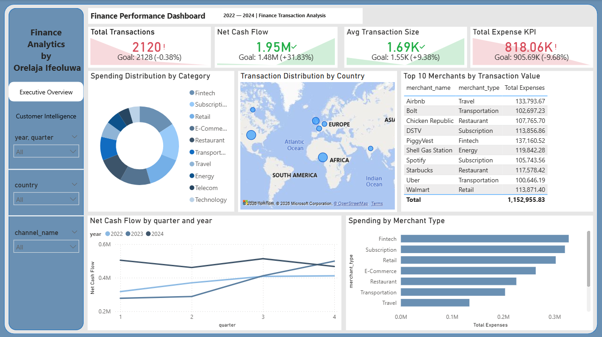
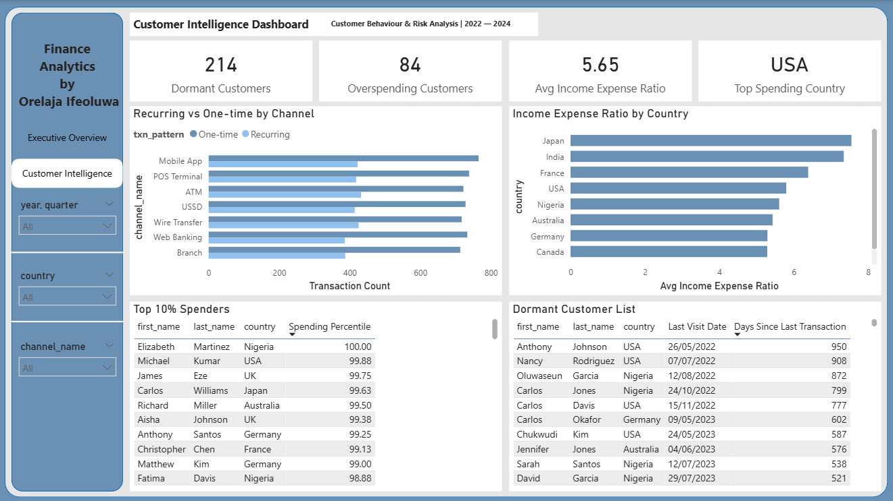

# 💰 Finance Transaction Analytics — SQL + Power BI

**By Orelaja Ifeoluwa**

---

## 📌 Project Overview

This is an end-to-end data analytics project built on a simulated personal finance dataset covering **2022 to 2024**. The idea was to go beyond just writing queries — I wanted to take raw transactional data, ask real business questions, answer them with SQL, and then present the findings in a dashboard that actually tells a story.

The full workflow: PostgreSQL for database setup → SQL for analysis → Power BI for the dashboard.

---

## 🗂️ Dataset

- **Source:** AI-generated (Claude) using a star schema structure
- **Schema:** `finance` schema within a PostgreSQL database (`sql_course`)
- **Period:** January 2022 — December 2024
- **Total Transactions:** 8,000 rows across 800 customers

### Schema Diagram
```
                     dim_date
                       |
dim_customer ──── fact_transactions ──── dim_merchant
      |               |        |
  dim_account    dim_category  dim_channel
```

### Fact Table: `fact_transactions` (8,000 rows)
| Column | Type | Description |
|--------|------|-------------|
| transaction_key | INT | Primary key |
| transaction_id | VARCHAR | Business key (TXN-000001) |
| date_key | INT | FK → dim_date |
| customer_key | INT | FK → dim_customer |
| account_key | INT | FK → dim_account |
| category_key | INT | FK → dim_transaction_category |
| merchant_key | INT | FK → dim_merchant (NULL for income) |
| channel_key | INT | FK → dim_channel |
| amount | DECIMAL | Negative = expense, Positive = income |
| abs_amount | DECIMAL | Absolute value of amount |
| transaction_type | VARCHAR | Income / Expense / Transfer |
| status | VARCHAR | Completed / Pending / Failed / Reversed |
| is_flagged | INT | Potentially suspicious (0/1) |
| is_recurring | INT | Recurring transaction (0/1) |

### Dimension Tables
| Table | Rows | Key Columns |
|-------|------|-------------|
| dim_date | 1,096 | year, quarter, month, day_of_week, is_weekend |
| dim_customer | 800 | demographics, country, annual_income, income_bracket, credit_rating |
| dim_account | 1,000 | account_type, currency, balance, interest_rate, status |
| dim_transaction_category | 20 | category_type (Income/Expense/Transfer), sub_type |
| dim_merchant | 20 | merchant_type, merchant_category, region |
| dim_channel | 7 | channel_type (Digital/Physical), is_self_service |

---

## 🛠️ Tools Used

| Tool | Purpose |
|------|---------|
| PostgreSQL | Database hosting and SQL querying |
| SQL | Data analysis — CTEs, window functions, aggregations, joins |
| Power BI Desktop | Dashboard design and visualisation |
| DAX | Calculated measures and columns in Power BI |
| VSCode | SQL editor |

---

## 🔍 SQL Analysis

All 11 analyses were written using CTEs, window functions, aggregations and joins. Every DAX measure in Power BI was cross-referenced against the SQL results to confirm accuracy.

### 1. Customers Whose Monthly Spending Exceeds 2x Their Income
Used a 3-CTE approach — convert annual income to monthly, aggregate completed expenses per customer per month, apply a running `SUM() OVER()` window function, then filter where spending > 2x income.

Key learning: window functions can't be filtered in `WHERE` — they need to be wrapped in a CTE first before any filtering can happen.

### 2. Month-over-Month Growth Rate of Transactions per Merchant
Used `LAG()` ordered by `year, month` to get previous month's transaction count. Applied `NULLIF` to guard division by zero and fixed an integer division bug using `::DECIMAL` cast — without this, only whole number multiples (0%, 100%, 200%) were showing as growth rates.

### 3. Dormant Accounts (No Transactions in 90+ Days)
Important distinction made here: a gap between two consecutive transactions isn't true dormancy — what matters is whether the customer's **last ever transaction** was 90+ days ago. Used `MAX()` aggregation, `CROSS JOIN` for the dataset's latest date, and date subtraction. Confirmed **214 dormant customers** via SQL, cross-referenced with Power BI DAX.

### 4. Customer Spending Trends — Monthly Rolling Average by Category
Built a yearly resetting rolling average by adding `year` to the `PARTITION BY` clause — this way the average resets every January instead of accumulating across the entire 3-year dataset. Filtered to Expenses and negative Transfers only, with a `HAVING` clause to drop months with zero spend.

### 5. Top 10% Spenders per Country
Compared `PERCENT_RANK()` vs `NTILE(10)` using `EXPLAIN ANALYZE`:
- NTILE: **111.829ms** execution time
- PERCENT_RANK: **129.831ms** execution time

PERCENT_RANK was chosen despite being slightly slower — on a small dataset the 18ms difference is negligible, and mathematical precision matters more than speed here.

### 6. Income vs Expense Ratio per Customer per Quarter
Used `amount` direction (positive/negative) rather than `transaction_type` to capture all money flows accurately — filtering by transaction type alone excluded too many valid records. Applied `NULLIF` for division by zero protection and kept the `dim_customer` join in the final SELECT only to keep the CTEs clean.

### 7. Recurring vs One-time Transaction Patterns by Channel
Initially defined recurring as ≥2 transactions with the same merchant — revised to **≥3** for a more meaningful definition. Results were pivoted using `CASE WHEN` aggregation in the final SELECT to display one row per channel with both percentages as columns rather than separate rows per pattern.

Results: ~98% one-time across all channels regardless of channel type — a significant customer loyalty finding.

### 8. Net Cash Flow per Customer per Month
Used `ELSE 0` instead of `ELSE NULL` in both CASE WHEN statements — this ensures months where a customer has no income still appear in the results with `total_income = 0` rather than being dropped entirely.

### 9. Top 10 Merchants by Transaction Value
Used `abs_amount` intentionally here — unlike customer spending analysis where direction matters, merchant transaction value should count both inflows and outflows since both represent activity through that merchant. Filtered to `status = 'Completed'` only.

### 10. Transaction Volume by Country
Simple `COUNT(*)` with `WHERE status = 'Completed'` — a clean example of when a basic `WHERE` filter is better than a `CASE WHEN` inside an aggregate.

### 11. Monthly Transaction Count Trend
Count of completed transactions grouped by `year` and `month` for Power BI trend analysis.

---

## 📊 Power BI Dashboard

Two-page dashboard connected via navigation buttons in the sidebar. Data connected directly from PostgreSQL — no CSV exports, live connection to the `sql_course` database.

---

### Page 1 — Executive Overview



High-level business performance summary. Built for someone who needs the key numbers fast without digging into the details.

#### KPIs (with YoY comparison)
| Metric | Value | YoY |
|--------|-------|-----|
| Total Transactions | 2,120 | -0.38% |
| Net Cash Flow | 1.95M | +31.83% |
| Avg Transaction Size | 1.69K | +9.38% |
| Total Expenses | 818.06K | -9.68% |

#### Visuals
- **Spending Distribution by Category** — Donut chart, Fintech leads
- **Transaction Distribution by Country** — Map visual with bubble sizing
- **Top 10 Merchants by Transaction Value** — Table filtered via Top N filter
- **Net Cash Flow by Quarter and Year** — Line chart, 2022/2023/2024 as separate lines
- **Spending by Merchant Type** — Horizontal bar chart

#### Slicers: Year/Quarter, Country, Channel

---

### Page 2 — Customer Intelligence



The deeper cut — customer behaviour, risk flags and spending patterns. Built for analysts and managers who need to act on the data.

#### KPIs
| Metric | Value |
|--------|-------|
| Dormant Customers | 214 |
| Overspending Customers | 84 |
| Avg Income Expense Ratio | 5.65 |
| Top Spending Country | USA |

#### Visuals
- **Recurring vs One-time by Channel** — Stacked bar chart per channel
- **Income Expense Ratio by Country** — Bar chart, Japan and India lead
- **Top 10% Spenders** — Table sorted by Spending Percentile DESC
- **Dormant Customer List** — Table sorted by Days Since Last Transaction DESC, includes Last Visit Date

---

## 💡 Key Findings

1. **Net Cash Flow grew 31.83% YoY** — and total transactions dropped slightly (-0.38%) at the same time. Fewer but higher value transactions — which is actually a good sign
2. **Fintech dominates spending** — PiggyVest leads all merchants at 137,160.52 in total transaction value
3. **2024 Q3/Q4 dip confirmed** — Net cash flow dropped below 2023 levels in the second half of 2024. The dataset runs through 31/12/2024 so this isn't incomplete data — expenses genuinely outpaced income in that period
4. **214 out of 800 customers (26.75%) are dormant** — that's over a quarter of the customer base with no activity in 90+ days. Anthony Johnson holds the record at 950 days inactive, last transaction 26/05/2022
5. **84 customers are overspending** relative to their monthly income — validated independently via both SQL and DAX
6. **~98% of customer-merchant relationships are one-time** across every channel — the recurring vs one-time split barely changes regardless of whether the channel is Mobile App, ATM, Branch or USSD
7. **Japan and India have the highest income expense ratios** — customers in these countries appear to earn significantly more relative to what they spend

---

## ⚠️ Notes & Known Limitations

**NULL merchant_key values are expected**
Income and transfer transactions don't have a merchant — that's by design. These NULL values were excluded from merchant-level visuals using visual-level filters rather than removing them from the dataset, so they still contribute to KPIs like Net Cash Flow and Total Transactions.

**Total Expense KPI shows red — that's actually good**
Power BI's KPI visual always colours a decline red. A -9.68% drop in expenses is a positive outcome — customers spent less. This is a known Power BI limitation where the colour logic can't be inverted for cost metrics.

**Total Transactions in red (-0.38%) alongside strong Net Cash Flow growth (+31.83%)**
These two together tell one story — fewer transactions but each one is worth more. Not a problem, just worth reading both numbers together.

**Recurring rate definition**
A customer-merchant relationship is only classified as recurring if the customer transacted with that merchant **3 or more times**. A ≥2 threshold was tested first but revised to ≥3 for a stricter and more meaningful definition of habit.

---

## 🚀 How to Use

### SQL Queries
1. Make sure PostgreSQL is running locally
2. Connect to the `sql_course` database
3. Navigate to the `finance` schema
4. Run any `.sql` file from the `finance/` folder

### Power BI Dashboard
1. Open Power BI Desktop
2. **Get Data → PostgreSQL → Server:** `localhost` **→ Database:** `sql_course`
3. Load all tables under the `finance` schema
4. Open `finance_dashboard.pbix`

---

## 📁 Repository Structure

```
SQL_Rep/
├── finance/
│   ├── assets/
│   │   ├── Executive_Overview_pg1.png
│   │   └── Customer_Intelligence_pg2.png
│   ├── Customer_spending_trends.sql
│   ├── customer_verify_bi.sql
│   ├── customers_with_2x_their_average_income_as_monthly_spending.sql
│   ├── Dormant_accounts.sql
│   ├── finance_dashboard.pbix
│   ├── finance_schema_setup.sql
│   ├── income_expense_ratio.sql
│   ├── MoM_growth_rate_of_txns_per_merchant.sql
│   ├── monthly_txn_count.sql
│   ├── net_cash_flow.sql
│   ├── Recurring_vs_one-time.sql
│   ├── sanity_check.sql
│   ├── top_10_mer_by_txn.sql
│   ├── Top_10%_spenders.sql
│   ├── Txn_volume_by_country.sql
│   ├── dim_account.csv
│   ├── dim_channel.csv
│   ├── dim_customer.csv
│   ├── dim_date.csv
│   ├── dim_merchant.csv
│   ├── dim_transaction_category.csv
│   ├── fact_transactions.csv
│   └── README.md
├── health/
├── SQL_Data_Job_Market_Analysis/
├── SCHEMA_REFERENCE.md
└── .gitignore
```

---

*Built as a portfolio project to show what end-to-end data analytics actually looks like — from writing the first query to shipping a dashboard.*
