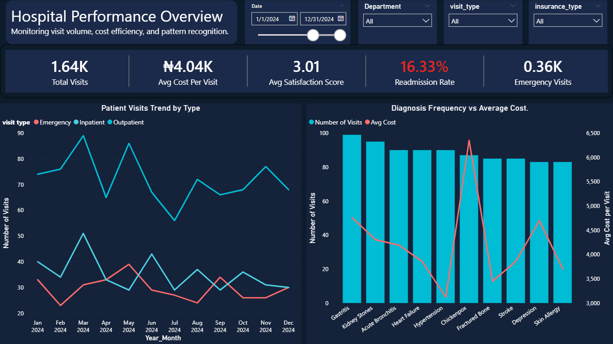
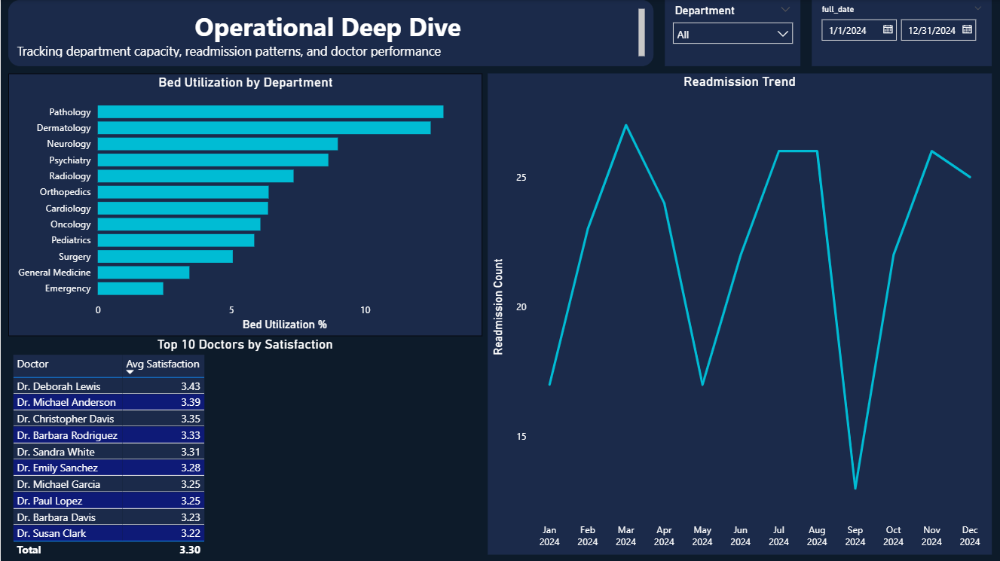

# Healthcare Analytics: Hospital Performance & Operations 🏥

End-to-end analytics project analyzing hospital patient visits, costs, and operational efficiency using SQL and Power BI.

## Project Overview

This project explores a healthcare star schema dataset containing 5,000 patient visits across 3 years (2022-2024). I wrote SQL queries to answer operational questions and built an interactive Power BI dashboard to visualize key performance metrics.

> **Note:** This project uses a synthetic dataset I generated to simulate realistic hospital data. The star schema structure, data distributions, and relationships were designed to mirror real-world healthcare scenarios for meaningful analysis.

**Tools Used:** PostgreSQL, Power BI, DAX

## Database Schema

```
                    dim_date
                       |
dim_patient ──── fact_patient_visits ──── dim_doctor
                    |        |
             dim_department  dim_diagnosis
                             dim_treatment
```

| Table | Rows | Description |
|-------|------|-------------|
| `fact_patient_visits` | 5,000 | Patient visits with costs, outcomes, satisfaction |
| `dim_date` | 1,096 | Date dimension (2022-2024) |
| `dim_patient` | 500 | Patient demographics, insurance type |
| `dim_doctor` | 50 | Doctor specializations, experience levels |
| `dim_department` | 12 | Hospital departments, bed capacity |
| `dim_diagnosis` | 20 | Diagnosis categories, severity |
| `dim_treatment` | 15 | Treatment types, base costs |

## SQL Analysis

I wrote 10 queries covering window functions, CTEs, aggregations, and date calculations:

### 1. Doctor Ranking by Department
Rank doctors by average patient satisfaction within each department using `RANK()` window function.

```sql
SELECT * FROM (
    SELECT
        dep.department_name,
        d.doctor_name,
        ROUND(AVG(f.satisfaction_score), 2) AS avg_satisfaction,
        RANK() OVER (PARTITION BY dep.department_name ORDER BY AVG(f.satisfaction_score) DESC) AS dept_rank
    FROM health.fact_patient_visits f
    INNER JOIN health.dim_doctor d ON d.doctor_key = f.doctor_key
    INNER JOIN health.dim_department dep ON dep.department_key = f.department_key
    GROUP BY dep.department_name, d.doctor_name
) AS ranked
WHERE dept_rank = 1;
```

### 2. Running Total of Costs per Patient
Calculate cumulative costs per patient over time using `SUM()` window function with tie-breaker for same-day visits.

```sql
SELECT
    p.patient_id,
    p.first_name,
    p.last_name,
    d.full_date,
    f.total_cost,
    SUM(f.total_cost) OVER (PARTITION BY p.patient_id ORDER BY d.full_date, f.visit_key) AS running_total
FROM health.fact_patient_visits f
INNER JOIN health.dim_patient p ON f.patient_key = p.patient_key
INNER JOIN health.dim_date d ON f.date_key = d.date_key
WHERE EXTRACT(QUARTER FROM d.full_date) = 2
  AND EXTRACT(YEAR FROM d.full_date) = 2024
ORDER BY p.patient_id, d.full_date;
```

### 3. Patients Readmitted Within 30 Days
Find patients with readmissions within 30 days of previous visit using `LAG()`.

```sql
SELECT * FROM (
    SELECT
        p.patient_id,
        p.first_name,
        p.last_name,
        d.full_date AS visit_date,
        LAG(d.full_date) OVER (PARTITION BY p.patient_id ORDER BY d.full_date) AS previous_visit_date,
        d.full_date - LAG(d.full_date) OVER (PARTITION BY p.patient_id ORDER BY d.full_date) AS days_between
    FROM health.fact_patient_visits f
    INNER JOIN health.dim_patient p ON f.patient_key = p.patient_key
    INNER JOIN health.dim_date d ON f.date_key = d.date_key
) AS visit_gaps
WHERE days_between <= 30
  AND EXTRACT(QUARTER FROM visit_date) = 4
  AND EXTRACT(YEAR FROM visit_date) = 2024;
```

### 4. Month-over-Month Emergency Visits
Track MoM change in emergency visits by department using `LAG()`.

```sql
SELECT * FROM (
    SELECT
        dep.department_name,
        dt.year,
        dt.month,
        dt.month_name,
        COUNT(*) AS emergency_visits,
        LAG(COUNT(*)) OVER (PARTITION BY dep.department_name ORDER BY dt.year, dt.month) AS previous_month_visits,
        COUNT(*) - LAG(COUNT(*)) OVER (PARTITION BY dep.department_name ORDER BY dt.year, dt.month) AS MoM_change
    FROM health.fact_patient_visits f
    INNER JOIN health.dim_department dep ON f.department_key = dep.department_key
    INNER JOIN health.dim_date dt ON f.date_key = dt.date_key
    WHERE f.visit_type = 'Emergency'
    GROUP BY dep.department_name, dt.year, dt.month, dt.month_name
) AS MoM_results
ORDER BY department_name, year, month;
```

### 5. Top 3 Most Expensive Diagnoses per Quarter
Identify costliest diagnoses each quarter using `DENSE_RANK()`.

```sql
SELECT * FROM(
    SELECT
        d.diagnosis_key,
        d.diagnosis_name,
        dat.year,
        dat.quarter,
        SUM(f.total_cost) AS diagnosis_cost,
        DENSE_RANK() OVER (PARTITION BY dat.year, dat.quarter ORDER BY SUM(f.total_cost) DESC) AS diagnosis_rank
    FROM health.fact_patient_visits f
    INNER JOIN health.dim_diagnosis d ON f.diagnosis_key = d.diagnosis_key
    INNER JOIN health.dim_date dat ON f.date_key = dat.date_key
    GROUP BY dat.year, dat.quarter, d.diagnosis_key, d.diagnosis_name
) AS rankings
WHERE diagnosis_rank <= 3
ORDER BY year, quarter, diagnosis_rank;
```

### 6. Bed Utilization vs Average Length of Stay
Calculate actual bed utilization percentage by department.

```sql
SELECT
    ROUND(AVG(f.length_of_stay_days), 2) AS avg_stay_days,
    dep.department_name,
    dep.bed_capacity,
    ROUND(SUM(f.length_of_stay_days)::NUMERIC / (dep.bed_capacity * 1096) * 100, 2) AS bed_utilization
FROM health.fact_patient_visits f
INNER JOIN health.dim_department dep ON f.department_key = dep.department_key
WHERE f.length_of_stay_days > 0
GROUP BY dep.department_name, dep.bed_capacity;
```

### 7. Patients with 3+ Departments Visited
Cross-department analysis using `HAVING` clause.

```sql
SELECT 
    pat.patient_id,
    pat.first_name,
    pat.last_name,
    pat.gender,
    COUNT(DISTINCT f.department_key) AS department_visits
FROM health.fact_patient_visits f
INNER JOIN health.dim_patient pat ON pat.patient_key = f.patient_key
GROUP BY pat.patient_id, pat.first_name, pat.last_name, pat.gender
HAVING COUNT(DISTINCT f.department_key) >= 3;
```

### Additional Queries
- **Most Demanded Doctor** — Aggregation by visit count
- **Most Fatal Disease** — Filtering by outcome = 'Deceased'

## Power BI Dashboard

### Page 1: Hospital Performance Overview
*Monitoring visit volume, cost efficiency, and pattern recognition*



**KPIs:**
- Total Visits: 1.64K
- Avg Cost Per Visit: ₦4.04K
- Avg Satisfaction Score: 3.01 (color-coded: orange indicates below 3.5 target)
- Readmission Rate: 16.33% (color-coded: red indicates above 15% threshold)
- Emergency Visits: 0.36K

**Visualizations:**
- Patient Visits Trend by Type (Emergency, Inpatient, Outpatient)
- Diagnosis Frequency vs Average Cost

**Slicers:** Date range, Department, Visit Type, Insurance Type

---

### Page 2: Operational Deep Dive
*Tracking department capacity, readmission patterns, and doctor performance*



**Visualizations:**
- Bed Utilization by Department (Pathology highest at ~14%)
- Top 10 Doctors by Satisfaction Score
- Readmission Trend over time

**Slicers:** Department, Date range

---

### DAX Measures

```dax
Bed Utilization % = 
DIVIDE(
    SUM('health fact_patient_visits'[length_of_stay_days]),
    MAX('health dim_department'[bed_capacity]) * DISTINCTCOUNT('health dim_date'[full_date])
) * 100
```

```dax
Emergency Visits = 
CALCULATE(
    COUNTROWS('health fact_patient_visits'),
    'health fact_patient_visits'[visit_type] = "Emergency"
)
```

```dax
Readmission Rate = 
DIVIDE(
    COUNTROWS(FILTER('health fact_patient_visits', 'health fact_patient_visits'[is_readmission] = TRUE())),
    COUNTROWS('health fact_patient_visits')
)
```

```dax
Year_Month = FORMAT('health dim_date'[full_date], "MMM YYYY")

Year_Month_Sort = 'health dim_date'[year] * 100 + 'health dim_date'[month]
```

## Key Insights & Benchmarks

1. **Readmission Rate of 16.33% exceeds industry benchmark (~12%)** — High readmission rates suggest patients may be discharged prematurely or lack adequate follow-up care, driving repeat visits and increased costs. This represents a key area for quality improvement.

2. **Average Satisfaction Score of 3.01 falls below the 3.5+ target** — The narrow range among top doctors (3.2–3.4) indicates consistently modest satisfaction levels across providers, suggesting a systemic issue rather than individual doctor performance.

3. **Pathology leads bed utilization at ~14%, Emergency lowest** — Emergency department's low utilization is expected due to high patient turnover (patients are stabilized then discharged or transferred quickly), while Pathology's sustained utilization reflects ongoing inpatient diagnostic demand.

4. **Outpatient visits consistently dominate volume** — Across all months, outpatient visits significantly outnumber Inpatient and Emergency, reflecting the hospital's role as a primary care access point.

5. **Fractured Bone drives highest average cost** — Despite moderate visit frequency, orthopedic cases generate disproportionate expenses, likely due to surgical intervention and longer recovery periods.

## Project Structure

```
├── README.md
├── sql/
│   ├── data_load.sql
│   ├── doctor_ranking_by_department.sql
│   ├── MoM_emergency_visits.sql
│   ├── most_demanded_doctor.sql
│   ├── most_expensive_diagnosis.sql
│   ├── most_fatal_disease.sql
│   ├── patients_readmitted.sql
│   ├── patients_with_3+_departments_visited.sql
│   ├── stay_vs_bed_capacity.sql
│   ├── top_doctor_by_department.sql
│   └── total_cost_per_patient.sql
├── dashboard/
│   └── Healthcare_Analytics.pbix
├── assets/
│   ├── dashboard_page1.png
│   └── dashboard_page2.png
└── data/
    ├── dim_date.csv
    ├── dim_patient.csv
    ├── dim_doctor.csv
    ├── dim_department.csv
    ├── dim_diagnosis.csv
    ├── dim_treatment.csv
    └── fact_patient_visits.csv
```

## Skills Demonstrated

- **SQL:** Window functions (RANK, DENSE_RANK, LAG, SUM), CTEs, multi-table JOINs, aggregations with HAVING, date extraction
- **Power BI:** Star schema modeling, DAX measures, conditional formatting, interactive dashboards, KPI cards, slicers
- **Data Analysis:** Healthcare metrics (readmission rate benchmarking, bed utilization engineering, satisfaction scoring), trend analysis, operational insights